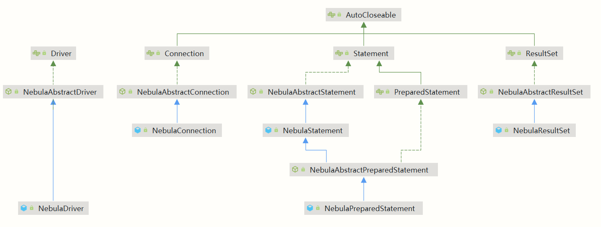

# 中文版

## 0. Introduction

nebula-jdbc 是 基于 [nebula-java](https://github.com/vesoft-inc/nebula-java) 封装的，在其基础上对接了 JDBC 协议，实现 JDBC 的相关接口。比起  [nebula-java](https://github.com/vesoft-inc/nebula-java) 你可能更加熟悉  JDBC  的 API，使用 nebula-jdbc 你可以不必熟悉 [nebula-java](https://github.com/vesoft-inc/nebula-java) 的 API(熟悉的话会更好，这样你会理解为什么我们连接字符串的格式是为什么与传统的 JDBC 连接字符串不同)，像在 java 程序中操作关系型数据库一样操作 Nebula 服务

## 1. Architecture

nebula-jdbc 主要的的一些类和接口的关系如下：(蓝色实线是类之间的 extends 关系，绿色实线是接口之间的 implements 关系，绿色虚线是抽象类与接口之间的 implements 关系)



用户首先通过 `NebulaDriver` 注册驱动，其中有 `NebulaPool` 属性，用于获取 `Session` 与数据库通信。`NebulaDriver` 中提供三个构造函数，无参构造函数按照默认参数配置 `NebulaPool`，接收一个 `Properties` 类型参数的构造函数可以自定义 `NebulaPool` 配置，接收一个 `String` 类型参数的构造函数可以只指定连接地址，其余参数按照默认配置。

注册驱动后用户可以通过 `DriverManager::getConnection(String url)` 获取 `Connection`。在 `NebulaConnection` 的构造函数中会通过 `NebulaDriver` 中的 `NebulaPool` 获取 `Session` 接着连接到在 url 中指定的图空间(graphSpace)。

获取到 `Connection` 后用户可以通过 `Connection::createStatement` 和 `Connection::prepareStatement` 拿到 `Statement` 或者 `PreparedStatement` 对象，调用其中的 `executeQuery、executeUpdate、execute` 方法向数据库发送命令，数据库执行此命令后的结果会封装在 `NebulaResult` 中，再调用其中各种获取数据的方法可以得到不同数据类型的数据。

## 2. Usage

```java
// 获取并注册默认的 NebulaDriver，默认的连接地址是 127.0.0.1：9669，其余的默认参数可以查看 NebulaDriver::setDefaultPoolProperties()
NebulaDriver defaultDriver = new NebulaDriver();

// 如果只想设置连接地，其余参数按照默认配置，则可以使用 NebulaDriver (String address)
NebulaDriver customizedUrlDriver = new NebulaDriver("192.168.66.116:9669");

// 如果要连接特定的服务地址以及自定义连接配置，可以使用自定义 NebulaDriver：将配置参数封装在一个 Properties 对象中，然后调用 NebulaDriver::NebulaDriver(Properties poolProperties)
Properties poolProperties = new Properties();
ArrayList<HostAddress> addressList = new ArrayList<>();
addressList.add(new HostAddress("192.168.66.226", 9669));
addressList.add(new HostAddress("192.168.66.222", 9670));

poolProperties.put("addressList", addressList);
poolProperties.put("minConnsSize", 2);
poolProperties.put("maxConnsSize", 12);
poolProperties.put("timeout", 1015);
poolProperties.put("idleTime", 727);
poolProperties.put("intervalIdle", 1256);
poolProperties.put("waitTime", 1256);

NebulaDriver customizedDriver = new NebulaDriver(poolProperties);

// 获取 Connection
Connection connection = DriverManager.getConnection("jdbc:nebula://JDBC_TEST_SPACE", "root", "nebula123");

// 获取 Statement 并执行
Statement statement = connection.createStatement();

String queryStatementNgql = "match (v:testNode) return v.theString as theString, v.theInt as theInt";
ResultSet queryStatementResult = statement.executeQuery(queryStatementNgql);

// 获取结果
while (queryStatementResult.next()){
String theString = queryStatementResult.getString("theString");
int theInt = queryStatementResult.getInt(2);
}

String insertTestNode = "INSERT VERTEX testNode (theString, theInt, theDouble, theTrueBool, theFalseBool, theDate, theTime, theDatetime) VALUES " +
    "\"testNode_7\":(\"Young\", 20, , 12.56, true, false, date(\"1949-10-01\"), time(\"15:00:00.000\"), datetime(\"1949-10-01T15:00:00.000\")); ";
statement.executeUpdate(insertTestNode);

// 获取 PreparedStatement，设置参数并执行
String insertPreparedStatementNgql = "INSERT VERTEX testNode (theString, theInt, theDouble, theTrueBool, theFalseBool, theDate, theTime, theDatetime) VALUES " +
    "\"testNode_8\":(?, ?, ?, ?, ?, ?, ?, ?); ";
PreparedStatement insertPreparedStatement = connection.prepareStatement(insertPreparedStatementNgql);

insertPreparedStatement.setString(1, "YYDS");
insertPreparedStatement.setInt(2, 98);
insertPreparedStatement.setDouble(3, 12.56);
insertPreparedStatement.setBoolean(4, true);
insertPreparedStatement.setBoolean(5, false);
insertPreparedStatement.setDate(6, Date.valueOf("1949-10-01"));
insertPreparedStatement.setTime(7, Time.valueOf("15:00:00"));
// 类型转换后再调用 setDatetime
NebulaPreparedStatement nebulaPreparedStatement = (NebulaPreparedStatement) insertPreparedStatement;
nebulaPreparedStatement.setDatetime(8, new java.util.Date());

insertPreparedStatement.execute();

// 关闭连接
connection.close();
```

## 3. Q & A

- 连接字符串"jdbc:nebula://graphSpace"中不用指定连接地址吗？

由于地址列表已经在 `NebulaDriver` 中配置(默认或自定义)，所以连接字符串不需要指定地址，只需要指定图空间。

- `PreparedStatement` 是否有预编译功能？

服务端暂不支持。

- `executeQuery`、`executeUpdate`、`execute` 的使用场景？

`executeQuery` 专门用于查询 Nebula 中的数据，此时 nGql 需包含查询关键字 ["match", "lookup", "go", "fetch", "find", "subgraph"]，返回查询结果 `ResultSet`；`executeUpdate` 用于修改数据，nGql 需包含修改关键字 ["update", "delete", "insert", "upsert", "create", "drop", "alter", "rebuild"]，返回查询结果 `0`；`execute` 用于其他 admin 操作，执行成功则返回查询 `true`。

- `executeUpdate` 的返回结果是0，为什么不是受到该语句影响的数据量？

目前服务端没有 updateCount 统计返回给用户。假如用户一条插入语句里面同时插入多个点或者多条边，这里面可能有部分成功，但服务端只会返回告诉用户失败了，但是其实用户可能能查到部分数据。统一返回0给用户。

- 查询语句中返回点、边、路径后在 Result 中应该如何获得？

将 `ResultSet` 转为 `NebulaResultSet`，然后调用 `getNode`、`getEdge`、`getPath`；对于列表、集合、映射也是如此。

# English Version

## 0. Introduction

nebula-jdbc is encapsulated based on  [nebula-java](https://github.com/vesoft-inc/nebula-java), interfacing with the JDBC protocol and implementing JDBC-related interfaces. You may be more familiar with the JDBC API than with  [nebula-java](https://github.com/vesoft-inc/nebula-java). With nebula-jdbc you do not need to be familiar with the  [nebula-java](https://github.com/vesoft-inc/nebula-java) API (it is better if you are, so that you understand why our connection strings are formatted differently from the traditional JDBC connection strings) and you can manipulate the Nebula service in the same way as you manipulate relational databases in a java application

## 1. Architecture

Some of main classes and interfaces relationships in nebula-jdbc are as follows: (the blue solid line is the extends relationship between classes, the green solid line is the implements relationship between interfaces, the green dashed line is the implements relationship between abstract classes and interfaces, and the green dashed line is the implements relationship between the abstract class and the interface)


The user first registers the driver with `NebulaDriver`, which has a `NebulaPool` property for getting the `Session` to communicate with the database. There are two constructors available in `NebulaDriver`, a
no-argument constructor that configures the default NebulaPool, a constructors that take a `Properties` as parameter can customise the NebulaPool configuration, and the construction that take a `String` as parameter can just specify an address to connect and let the rest parameters to be set as default

After registering the driver, the user can get the `Connection` via `DriverManager::getConnection(String url)`, and the `NebulaConnection` constructor will get the `Session` from the `NebulaPool` in the `NebulaDriver` and then connects to the graph space specified in the url

Once the `Connection` is obtained, the user can get a `Statement` or `PreparedStatement` object through `Connection::createStatement` and `Connection::prepareStatement` to call the `executeQuery, executeUpdate, execute` methods to send commands to the database. The result of this command is encapsulated in `NebulaResult`, which can be used to obtain different types of data by calling the various methods with different return data type

## 2. Usage

```java
// Get and register the default NebulaDriver, the default connection address is 127.0.0.1:9669, the rest of the default parameters can be found in NebulaDriver::setDefaultPoolProperties()
NebulaDriver defaultDriver = new NebulaDriver();

// If you just need to specify an address to connect and let the rest parameters to be set as default, NebulaDriver (String address) can be used
NebulaDriver customizedUrlDriver = new NebulaDriver("192.168.66.116:9669");

// If you want to connect to a specific service address and customize the connection configuration, you can use a custom NebulaDriver by encapsulating the configuration parameters in a Properties object and call NebulaDriver::NebulaDriver(Properties poolProperties)
Properties poolProperties = new Properties();
ArrayList<HostAddress> addressList = new ArrayList<>();
addressList.add(new HostAddress("192.168.66.226", 9669));
addressList.add(new HostAddress("192.168.66.222", 9670));

poolProperties.put("addressList", addressList);
poolProperties.put("minConnsSize", 2);
poolProperties.put("maxConnsSize", 12);
poolProperties.put("timeout", 1015);
poolProperties.put("idleTime", 727);
poolProperties.put("intervalIdle", 1256);
poolProperties.put("waitTime", 1256);

NebulaDriver customizedDriver = new NebulaDriver(poolProperties);

// get Connection
Connection connection = DriverManager.getConnection("jdbc:nebula://JDBC_TEST_SPACE", "root", "nebula123");

// get Statement and execute
Statement statement = connection.createStatement();

String queryStatementNgql = "match (v:testNode) return v.theString as theString, v.theInt as theInt";
ResultSet queryStatementResult = statement.executeQuery(queryStatementNgql);

// get data from resultset
while (queryStatementResult.next()){
String theString = queryStatementResult.getString("theString");
int theInt = queryStatementResult.getInt(2);
}

String insertTestNode = "INSERT VERTEX testNode (theString, theInt, theDouble, theTrueBool, theFalseBool, theDate, theTime, theDatetime) VALUES " +
    "\"testNode_7\":(\"Young\", 20, , 12.56, true, false, date(\"1949-10-01\"), time(\"15:00:00.000\"), datetime(\"1949-10-01T15:00:00.000\")); ";
statement.executeUpdate(insertTestNode);

// get PreparedStatement, set configuration parameters and execute
String insertPreparedStatementNgql = "INSERT VERTEX testNode (theString, theInt, theDouble, theTrueBool, theFalseBool, theDate, theTime, theDatetime) VALUES " +
    "\"testNode_8\":(?, ?, ?, ?, ?, ?, ?, ?); ";
PreparedStatement insertPreparedStatement = connection.prepareStatement(insertPreparedStatementNgql);

insertPreparedStatement.setString(1, "YYDS");
insertPreparedStatement.setInt(2, 98);
insertPreparedStatement.setDouble(3, 12.56);
insertPreparedStatement.setBoolean(4, true);
insertPreparedStatement.setBoolean(5, false);
insertPreparedStatement.setDate(6, Date.valueOf("1949-10-01"));
insertPreparedStatement.setTime(7, Time.valueOf("15:00:00"));
// make a class cast and then call setDatetime
NebulaPreparedStatement nebulaPreparedStatement = (NebulaPreparedStatement) insertPreparedStatement;
nebulaPreparedStatement.setDatetime(8, new java.util.Date());

insertPreparedStatement.execute();

//  close connection
connection.close();
```

## 3. Q & A

- Don't I need to specify the connection address in the connection string "jdbc:nebula://graphSpace"?

As the address list is already configured in NebulaDriver (default or custom), the connection string does not need to specify an address, only the graph space is required

- Does PreparedStatement have a pre-compile function?

No, the server does not support it at the moment.

- What are the usage scenarios for `executeQuery`, `executeUpdate`, `execute`?

`executeQuery` is used only for querying data in Nebula, where nGql needs to contain the query keywords ["match", "lookup", "go", "fetch", "find", "subgraph"] and return the result `ResultSet`; `executeUpdate` is used for modifying data, where nGql needs to contain the modify keyword
["update", "delete", "insert", "upsert", "create", "drop", "alter", "rebuild"], returns `0` as result in all case; `execute` for other admin operations, and returns `true` if the execution succeeds.

- The result of executeUpdate is `0`. Why is it not the amount of data affected by the statement?

If the user inserts multiple points or edges in a single insert statement, some of them may succeed and some of them may not, but the server will only return to tell the user that it has failed, however, the user may actually be able to find out some of the data have inserted. So this method will just return `0`

- How should I get the node, edge and path in `ResultSet` after they are returned in the query statement?

Convert `ResultSet` to `NebulaResultSet`, then call getNode, getEdge, getPath; the same for list, set, and map.

